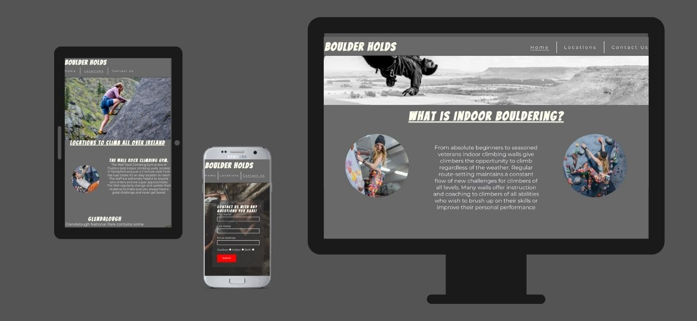
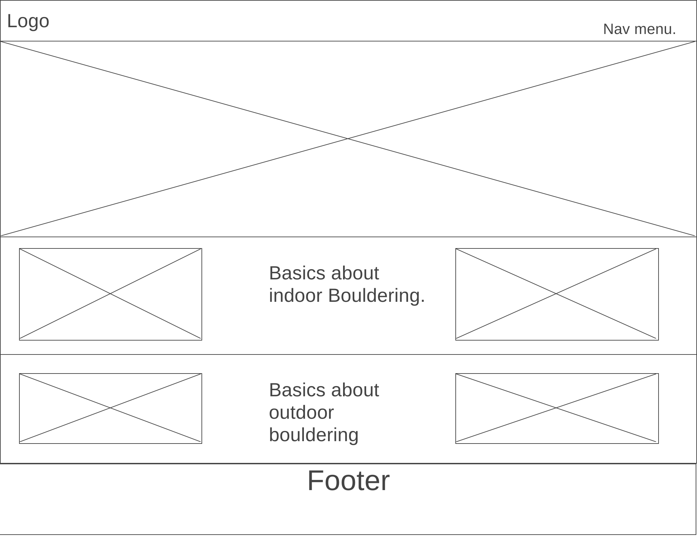
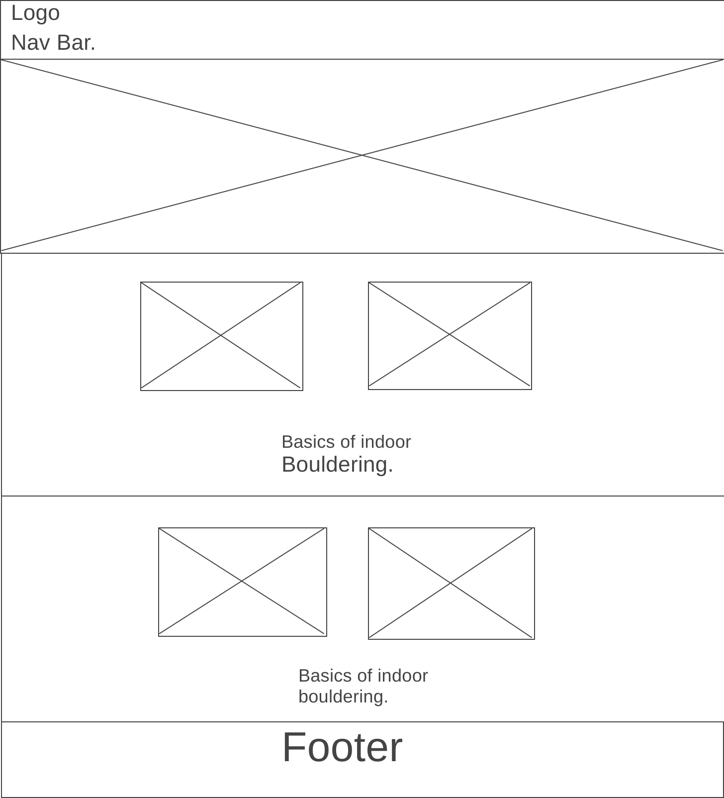
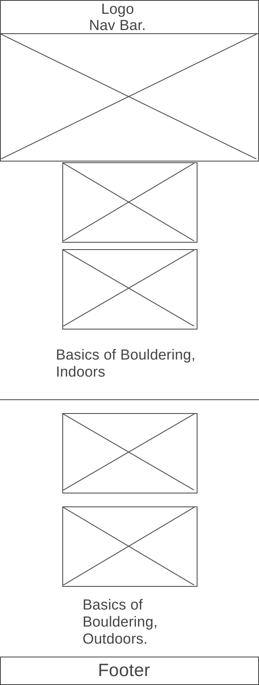
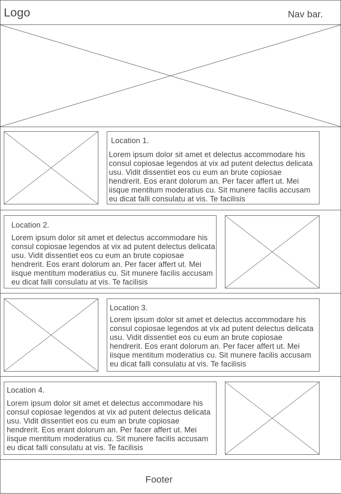
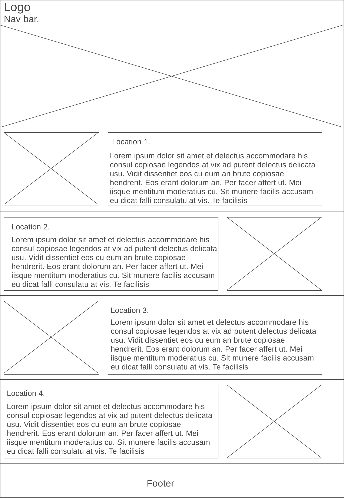
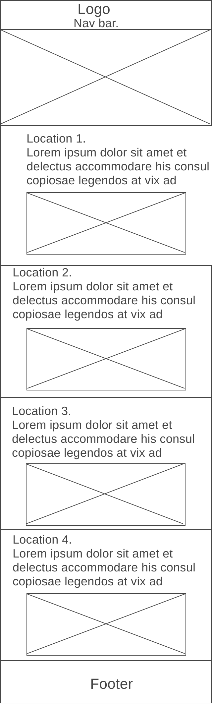
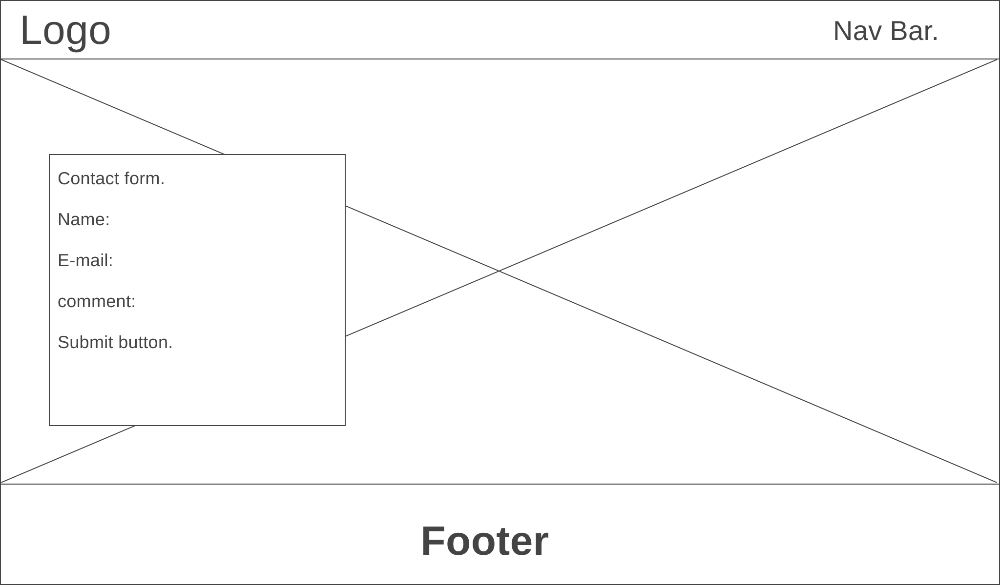
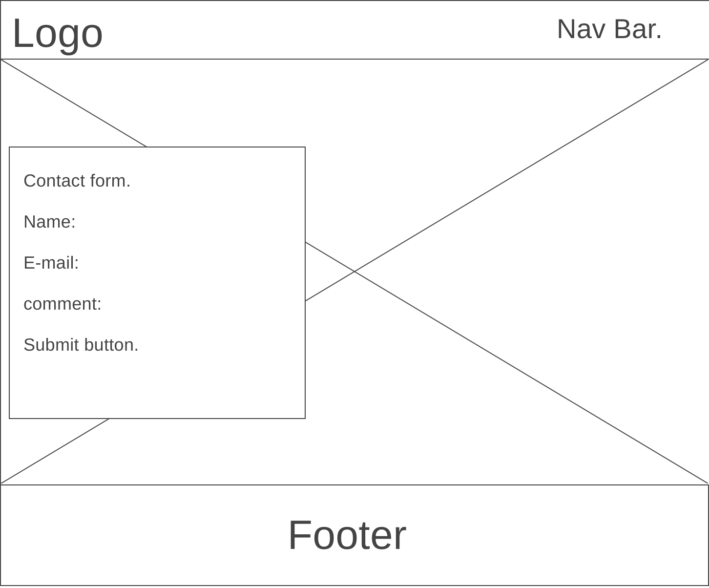
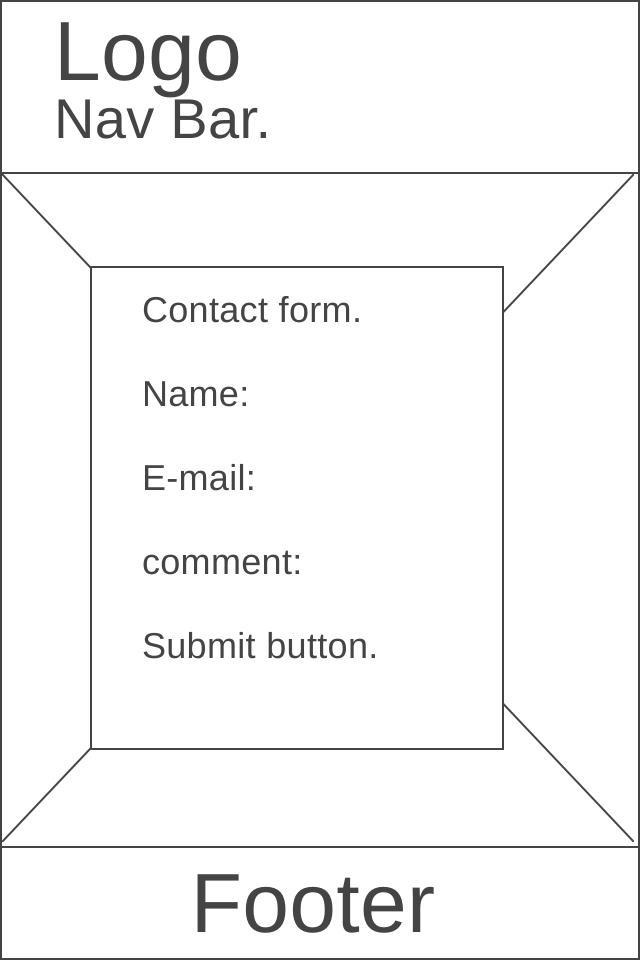

# Lewis's Portfolio website

## HTML and CSS Essentials Project.

The Website I created provides information about both indoor, outdoor rock climbing and locations for rock climbing.

This website is for educational purposes only and cannot be used as a template for use by a buisness.
The aim of this project is to build a website using only HTML and CSS.

## [Live website with github pages.](https://lewisbambrick.github.io/MP1/)

---

# Table of Contents
- [User Experience](#User-Experience)
    - [Website Owner Goals](#website-owner-goals)
    - [User goals](#user-goals)
        - [New users](#new-users)
       - [Returning users](#returning-users)
    - [User stories](#user-stories)
    - [Structure of the website](#structure-of-the-website)
    - [Wireframes](#wireframes)
    - [Design Templates](#design-templates)

# User Experience

## Website Owner Goals

This site was created to teach people more about bouldering, both indoor and outdoor.
This site also provides excelent information about multiple climbing locations across Ireland and a brief description of them.

## User Goals

### New Users:
    -User is able to see what bouldering is all about quickly and simply.
    -User is able to find locations they can go bouldering, and information about them.
    -Can easily contact site owners to ask any question they have about bouldering.

### Returning Users: 
    -Users can return with any more questions they might have.
    -can return to find other new locations to climb.

## User Stories

### As a New User:
    -I would like to be able to find out what rock climing is and basic information about it easily.
    -I would like to find out information about where I can boulder across Ireland, and a brief description of them.
    -I would like to be able to ask any question I have about bouldering that the site didnt already answer.

### As A Returning User:
    -I would like to be able to return and ask any new questions I might have. 
    -I would like to be able to return to find more information about different locations to go bouldering.
    
### As The Site Owner:
    -I would like my users to be able to navigate and find the information they need to on my site as smooth and easily as possible.
    -I would like my users to not hesitate in sending off their questions to me.
    -I would like my customers to recognize the site as a reliable site with accurate information.

## Structure of The Website:
This website is made to be smooth, clear and easy to navigate. It is adaptable for all types of devices so as that it will always be smooth and user-friendly. The User will be very satisfied with the interaction, look and feel of the form on the Contact Us page.

## Wireframes
1.Index on PC.

2.Index on Tablet.

3.Index on Mobile.

4.Locations on PC.

5.Locations on Tablet.

6.Locations on Mobile.

7.Contact-Us on PC.

8.Contact-Us on Tablet.

9.Contact-Us on Mobile.

## Design Templates

### Fonts
    The Fonts I have chosen for my site are:
        *Bangers
        *Montserrat.
        *Back-up font of Sans-serif
    These fonts were chosen because I believe they match up together really well.The fonts also give a great overall feel of the website.

### Colours 
The main colours I chose to use for my site are:

        *Background colour: rgb 105, 105, 105. 
        *Font Colour: rgb 258, 248, 255. 
        *Heading Colour: rgb 255, 255, 240. 
        *Form Background: rgba 60, 60, 60, 0.6. 
        *form hover/submit button: rgb 255, 0, 0. 

### Images 
All of the images I've used on my site were taken from [Pexels](https://www.pexels.com/), they are credited in my Credit section.

[Back to Table of contents](#table-of-contents)