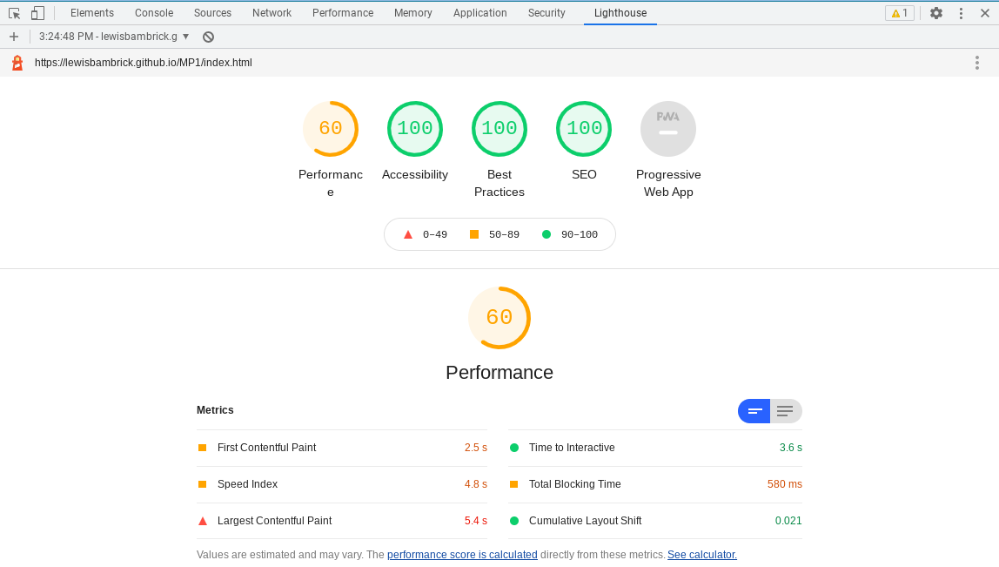

# Lewis's Portfolio website

## HTML and CSS Essentials Project.

 

The Website I created provides information about both indoor, outdoor rock climbing and locations for rock climbing.

This website is for educational purposes only and cannot be used as a template for use by a business.
The aim of this project is to build a website using only HTML and CSS.

## [Live website with github pages.](https://lewisbambrick.github.io/MP1/)

---

# Table of Contents
- [User Experience](#User-Experience)
    - [Website Owner Goals](#website-owner-goals)
    - [User Goals](#user-goals)
        - [New Users](#new-users)
       - [Returning Users](#returning-users)
    - [User stories](#user-stories)
    - [Structure of the Website](#structure-of-the-website)
    - [Wireframes](#wireframes)
    - [Design Templates](#design-templates)
- [Technology](#technology)
- [Features of the Site](#features-of-the-site)
- [Testing](#testing)
    - [Compatability Testing](#compatability-testing)
    - [Functionality testing](#Functionality-testing)
    - [User Story testing](#User-Story-testing)
    - [Issues and Fixes](#Issues-and-Fixes)
    - [Code Validation](#Code-Validation)
    - [Performance Test](#Performance-Test)
- [Deployment](#deployment)
- [Credits](#credits)
# User Experience

## Website Owner Goals

This site was created to teach people more about bouldering, both indoor and outdoor.
This site also provides excellent information about multiple climbing locations across Ireland and a brief description of them.

## User Goals

### New Users:
    -User is able to see what bouldering is all about, quickly and simply.
    -User is able to find locations they can go bouldering and information about them.
    -User can easily contact site owners to ask any question they have about bouldering.

### Returning Users: 
    -Users can return with any more questions they might have.
    -Users can return to find other new locations to climb.

## User Stories

### As a New User:
    -I would like to be able to find out what rock climbing is and basic information about it easily.
    -I would like to find out information about where I can boulder across Ireland, and a brief description of each location.
    -I would like to be able to ask any question I have about bouldering that the site didn't already answer.

### As A Returning User:
    -I would like to be able to return and ask any new questions I might have. 
    -I would like to be able to return to find more information about different locations to go bouldering.
    
### As The Site Owner:
    -I would like my users to be able to navigate and find the information they need to on my site as smoothly and easily as possible.
    -I would like my users to not hesitate in sending off their questions to me.
    -I would like my customers to recognize the site as a reliable site with accurate information.

## Structure of The Website:
This website is made to be smooth, clear and easy to navigate. It is adapted for all types of devices so that it will always be smooth and user-friendly. The User will be very satisfied with the interaction and look and feel of the form on the Contact Us page.

## Wireframes
1.Index on PC.

2.Index on Tablet.

3.Index on Mobile.

4.Locations on PC.

5.Locations on Tablet.

6.Locations on Mobile.

7.Contact-Us on PC.

8.Contact-Us on Tablet.

9.Contact-Us on Mobile.

## Design Templates

### Fonts
    The Fonts I have chosen for my site are:
        *Bangers
        *Montserrat.
        *Back-up font of Sans-serif
    Bangers is a large and bold font, alluding to the nature of bouldering giving that rugged, natural feel to the site's headlines.  Montserrat is an elegant sans serif font used for the body because it is easy-to-read in order to ensure website accessibility.
### Colours 
The main colours I chose to use for my site are:

        *Background colour: rgb 105, 105, 105. 
        *Font Colour: rgb 258, 248, 255. 
        *Heading Colour: rgb 255, 255, 240. 
        *Form Background: rgba 60, 60, 60, 0.6. 
        *form hover/submit button: rgb 255, 0, 0. 

### Images 
All of the images I've used on my site were taken from [Pexels](https://www.pexels.com/), they are credited in my Credit section.

[Back to Table of contents](#table-of-contents)
---

# Technology

## Technologies used for this site are:

### HTML5 
    -As the structure code of the website.

### CSS 
    -As the styling Coding language for the website.

### Git 
    -As a source control system tracking.

### GitHub 
    -As the software hosting platform. This keeps my project remote.

### Gitpod
    -As a container-based development platform.

### Google Fonts
    -As the font resource for my site.

### Font Awesome
    -As a library for the icons for my social media links.

### Wireframe .cc
    -As a wireframing tool for building my wireframes.

### Canva
    -As an image editor for my README.

[Back to Table of contents](#table-of-contents)
---

# Features of The Site

The website that I have created is made up of 4 pages. Three of those pages are part of the normal navigation of the website that is accessible from the navigation links.
The last page is just a submission confirmation page from the Contact-Us page form.

The Features of my website are:

## Header
    The header is fixed to the top of the screen so it's always visible to the user.
* ### Logo
    The logo on the site is on the left side of my header. The logo is also a navigation link to bring the user back to the home page.

* ### Navigation Bar
    The Navigation bar is located on the right side of the header.The nav bar is adaptive and will change position to under the logo when a screen moves to under the logo.
    The Nav bar consists of three links:    
    - Home 
    - Locations
    - Contact Us
    The links have a hover styling on them that underlines them while you hover over them. There is also an active styling on it. This makes the link for the page that the user is currently on be underlined, that way they can always see what page they're on.

## Main Image
    Each page has a main image that the user starts out on.
* ### Images 
    All of the images that I used for the main images were sourced from Pexels, a free stock image website. Each page has a unique main image to help the user know what page they are on.

* ### Animation 
    Both the main images for the Home page and the Locations page have keyframes animations.The animation I chose was a zoom animation. This gives the effect of the main image zooming in when the user visits the page.

## Footer
     For my site I decided to keep the footer very simple. To achieve this, I decided to just keep the footer content limited to just social media links-Facebook, Twitter, Instagram. The links that I used for the social media links were from The Wall Climbing Gym.

## Home 
* ### Indoor Bouldering
    This is the first section of unique home page content. This section starts off with an eye-catching heading text ensuring the user knows exactly what they're looking at.
    There are also two images and some text content. These are centered around the basics of indoor bouldering.

* ### Outdoor Bouldering
    This is the second section of the home pages unique content. This section also starts off with an impactful heading to help to guide the user. Like the first section this section is also comprised of two images and text content. However, this one is all about Outdoor Bouldering.

## Locations 
    The Locations page consists of a list of places to rock climb all across Ireland. Each location section is comprised of an image, a heading with the place name, and also a brief description of the place.
    The list is evenly split between indoor and outdoor places.

## Contact Us
    The content for the Contact-Us page that is unique to that page is the form. This form is to contact the owners of the website about any rock climbing questions the user has.
    The form collects basic information, such as First Name, Last Name, Email Address, their question and preference on type of rock climbing.

## Future Implementation 
    * Regular updates and expanding of the locations list.
    * Possibly adding an events page and adding a call to action on the home page for it.
    * Updates to the basics of rock climbing.

[Back to Table of contents](#table-of-contents)
---

# Testing

## Compatibility testing
    I tested my site on multiple devices and browsers. I did this by using the Chrome development tools on my Chrome book.
    My site was also tested on my Chromebook, an iPhone 5 and a Google Pixel 4a.

## Functionality testing
    For the duration of my project I used my Chrome developer tools to keep testing with styles and responsiveness.

## User Story testing

### As a new User:
- I would like to be able to find out what rock climbing is and basic information about it easily.
    > Information about Rock climbing is clear and easy to find on the first page users visit the site on. The information is eye-catching, and clearly separated into sections for both indoor and outdoor bouldering.
- I would like to find out information about where I can boulder across Ireland, and a brief description of the locations.
    > The Locations page is very easy to find for Users. Once they get to that page it is really easy to find the locations we have on the page, and the information about that location.
- I would like to be able to ask any question I have about bouldering that the site didnt already answer.
    > The Contact Us page is very easy to find for all Users to find. Once users get there the Form is visible straight away. The Form is also easy to use and eye-catching.

### As a Returning User:
- I would like to be able to return and ask any new questions I might have.
    > The Form leaves it open to always ask anything about Rock climbing so it is very easy to return to ask new questions.
- I would like to be able to return to find more information about different locations to go bouldering. 
    > Locations page has multiple locations, so after a user learns about and visits a location, they can return to learn about others.

### As the Site Owner:
- I would like my users to be able to navigate and find the information they need to on my site as smoothly and easily as possible.
    > The Navigation menu is easy to find and stays fixed to the top of the screen.
- I would like my users to not hesitate in sending off their questions to me.
    >The Contact Us form is very eye-catching, simple and user-friendly.
- I would like my customers to recognize the site as a reliable site with accurate information.
    >All the information used is very accurate and trustworthy, and will build the sites good reputation.

--- 

## Issues and Fixes
- ### Menu was out of order
    While I was creating the Nav menu for my website I had forgotten to order the list backwards for when Floating the list items.
    > I fixed it by simply rearranging the order of my menu in the HTML code.

- ### Main image on Contact Us page was off center
    After creating the Contact Us page I realized that I had forgotten to center the image.
    > I quickly corrected this by adding the Center shorthand on to the end of the image link.

- ### Youtube link was broken.
    While testing my site at the end of creating it I noticed that the Youtube link for my social media links in the footer was broken.
    >This was because I had made a typo that had the "https" part of the link repeated. I fixed this simply by deleting one of the "https"'s

## Code Validation
    At the end of my project, I Validated both my CSS code and my HTML code using:
 -  [W3C CSS Validator](https://jigsaw.w3.org/css-validator/) to validate CSS.
 - [Nu Html Checker](https://validator.w3.org/) to test HTML.

## Performance Test
    To test the performance of my site I used the Google developer tool, Lighthouse.
    Find screenshot below:

[Back to Table of contents](#table-of-contents)
--- 
# Deployment

The project was deployed on GitHub Pages. I used Gitpod as a development environment where I commited all changes to git version control system.
I used the push command in Gitpod to save changes into GitHub.

To run locally:
* Log in to GitHub and click on repository to download ([MP1](https://github.com/lewisbambrick/MP1)).
* Select "Code" and click Download the ZIP file.
* After downloading the file you can extract the file and use it in your local environment.

To deploy the project I had to:

* Log in to GitHub and click on repository to deploy ([MP1](https://github.com/lewisbambrick/MP1))
* Select "Settings" and find the "GitHub Pages" section at the very bottom of the page.
* From source select "none" and then "master branch".
* Click "save" and the page was deployed after auto-refresh.
*  My site was published at https://lewisbambrick.github.io/MP1/

[Back to Table of contents](#table-of-contents)
---
# Credits
* For this project I used the Code Institute student Template [gitpod full template](https://github.com/Code-Institute-Org/gitpod-full-template)
* ### Ideas
    - Many of the resources I reviewed from the Code Institute, such as the Love Running practice project, served as inspiration for this project. 

    Among the ideas that stemmed from this earlier project were:
        * Navigation menu layout.
        * Contact Us Form.
        * Footer, Social links.
        * The idea of using circular images.
        * I got the idea and code help for the keyframe animation for the main image.
    
* ### General Content
    - text content for Outdoor Bouldering-[explore share](https://www.explore-share.com/blog/what-is-bouldering/)
    - text content for Indoor Bouldering-[Mountaineering](https://www.mountaineering.ie/Climbing/IndoorClimbing/default.aspx)
    - text content for the Scalp location [wiki-climbing](http://wiki.climbing.ie/index.php?title=The_Scalp&redirect=no)
    - text content for gravity location [gravity-climbing](https://www.gravityclimbing.ie/)
    - text content for Glendalough location [Glendalough](https://hikeandclimb.ie/glendalough/)
    - text content for The Wall location [TheWall](https://www.thewall.ie/)

* ### Images
    All images that I have used for my site have been taken from [Pexels](https://www.pexels.com/) a free image site.

* ### Icons
    The Icons that I have used for my social media links in the footer were taken from [fontawesome](https://fontawesome.com/)

[Back to Table of contents](#table-of-contents)
